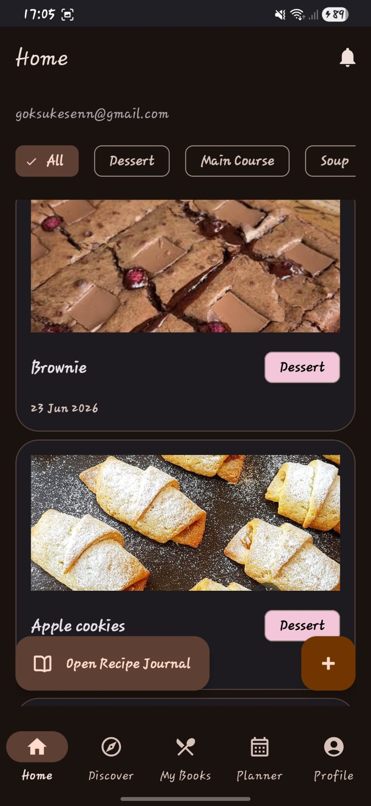
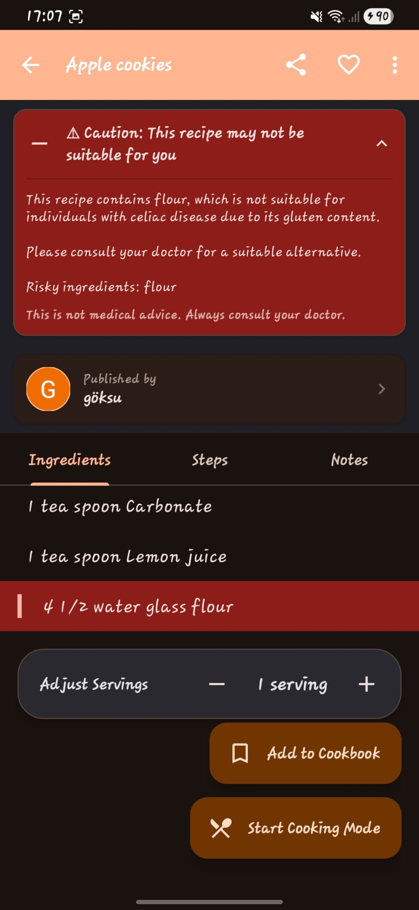
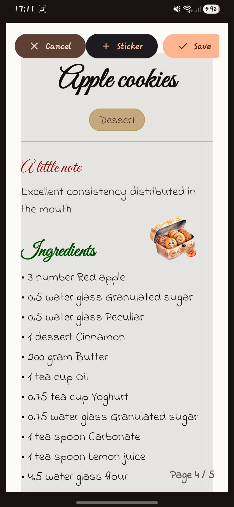

<div align="center">


# RecipeBookPro 🍳

**A full-featured Android recipe management app with cloud sync, AI-powered nutrition analysis, and offline support.**

[](https://developer.android.com)
[](https://kotlinlang.org)
[](https://firebase.google.com)
[](https://groq.com)
[](.)

</div>

---

## Overview

**RecipeBookPro** is an Android application that brings together recipe discovery, meal planning, and smart shopping in one place. Users can create and manage recipes with photos, plan their weekly meals, and get AI-generated nutrition insights — all backed by Firebase with full offline support via local Room Database.

Developed as a team project for the **Mobile Programming** course at the university, under the guidance of **Abdullah Talha Kabakuş**.

---
## Screenshots

<div align="center">
  
  
  
</div>

<p align="center">
  Home feed with category filtering • Personalized recipe warnings • Recipe journal view
</p>

---

## Features

### 🔐 Authentication
- Email/password sign-in and Google Sign-In (via modern `CredentialManager` API)
- Onboarding flow for first-time users

### 🍽️ Recipe Management
- Create, edit, and delete recipes with title, ingredients, steps, and photos
- Reorder preparation steps via drag-and-drop (`ItemTouchHelper`)
- Add photos from camera or gallery
- Share recipes directly via email (JavaMail / SMTP)

### 📅 Meal Planning
- Weekly planner to assign recipes to specific days (`PlannerFragment`)
- Daily and weekly calorie summaries

### 🛒 Smart Shopping List
- Automatically merges ingredients from a weekly meal plan into one unified shopping list
- Background processing with `WorkManager` (`MergeIngredientsWorker`), with unit-aware quantity calculations

### 🤖 AI & Machine Learning
- **Groq API (Cloud):**
  - Calorie and macronutrient estimation for recipes (`GroqAiNutritionService`)
  - Health profile analysis and personalized feedback (`GroqHealthProfileAnalyzer`)
- **Google ML Kit (On-Device):**
  - Offline-capable recipe translation — titles, content, and ingredients translated to the user's language (`MLKitTranslationService`)

### ☁️ Cloud & Sync
- Real-time sync for recipes, meal plans, shopping lists, and user profiles via **Firebase Firestore**
- Recipe photo and media storage via **Firebase Storage**
- Push notifications via **Firebase Cloud Messaging (FCM)**
- Deep linking and in-app share links via **Firebase Hosting**

### 📴 Offline Support
- Local SQLite storage using **Room Database** (`AppDatabase`, `UserDao`, etc.) for offline-first functionality

---

## Tech Stack

| Category | Technologies |
|---|---|
| Language | Java 17 (primary), Kotlin (supporting) |
| Min / Target SDK | 33 / 34 |
| UI | XML Layouts, Material Design 3, ConstraintLayout, ViewPager2 |
| Navigation | Android Navigation Component |
| Cloud Backend | Firebase Auth, Firestore, Storage, FCM, Hosting |
| Local Database | Room Database |
| AI (Cloud) | Groq API |
| AI (On-Device) | Google ML Kit Translation |
| Background Tasks | WorkManager |
| Image Loading | Coil |
| Email Sharing | JavaMail API (SMTP) |
| Data Serialization | Gson |
| Async / Concurrency | Google Play Services Tasks (`Tasks.whenAllSuccess`) |

---

## Project Structure

```
RecipeBookPro/
├── app/
│   ├── src/main/java/        # Java & Kotlin source code
│   ├── src/main/res/         # XML layouts, drawables, strings
│   └── google-services.json  # Firebase config (not committed)
├── gradle/                   # Gradle wrapper
├── firestore.rules           # Firestore security rules
├── firebase.json             # Firebase project config
└── build.gradle              # Project-level build config
```

---

## Getting Started

### Prerequisites
- Android Studio (latest stable)
- A Firebase project with Authentication, Firestore, Storage, FCM, and Hosting enabled
- A [Groq API key](https://console.groq.com)
- A Gmail account with an App Password for SMTP

### Setup

1. **Clone the repository:**
   ```bash
   git clone https://github.com/Busrabasan67/RecipeBookPro.git
   cd RecipeBookPro
   ```

2. **Open in Android Studio** and sync Gradle.

3. **Add your Firebase config file** at:
   ```
   app/google-services.json
   ```

4. **Add the following to `local.properties`:**
   ```properties
   GROQ_API_KEY="your_groq_api_key"
   SMTP_EMAIL="your_email@gmail.com"
   SMTP_PASSWORD="your_app_password"
   SHARE_HTTPS_REDIRECT_BASE="your_firebase_hosting_url"
   ```

5. **Build and run** on an emulator (API 33+) or a physical device.

---

## Security

Sensitive credentials (API keys, Firebase service files, SMTP passwords) are excluded from version control via `.gitignore`. Each developer must configure their own `local.properties` and `google-services.json` locally.

---

## Team

| Name | GitHub |
|---|---|
| Büşra Basan | [@BüşraBasan](https://github.com/Busrabasan67) |
| Emine Hatun Çakmak | [@EmineHatunÇakmak](https://github.com/nemakun0) |
| Zeynep Can | [@ZeynepCan](https://github.com/zeyynepp0) |
| Kadir Ocak | [@KadirOcak](https://github.com/Ksiwa) |
| Göksu Kesen | [@GöksuKesen](https://github.com/gksukesenn) |

---

## Course Context

Developed as a team project for the **Mobile Programming** course, under the guidance of **Abdullah Talha Kabakuş**.

---

## License

This repository is for educational and portfolio purposes only.
